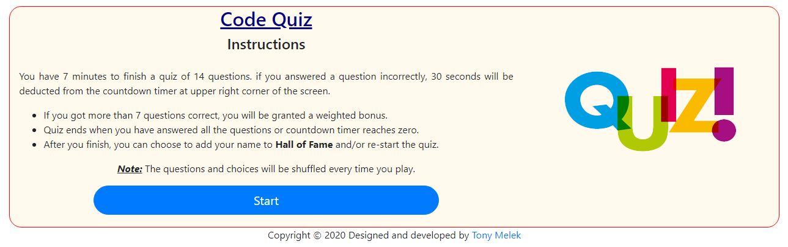
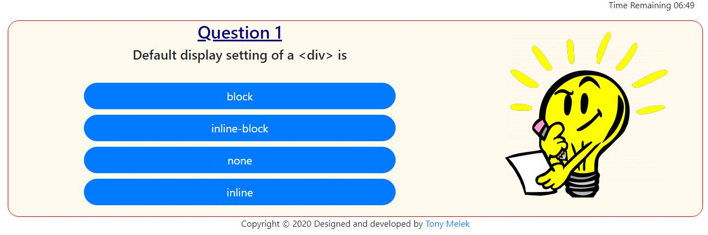
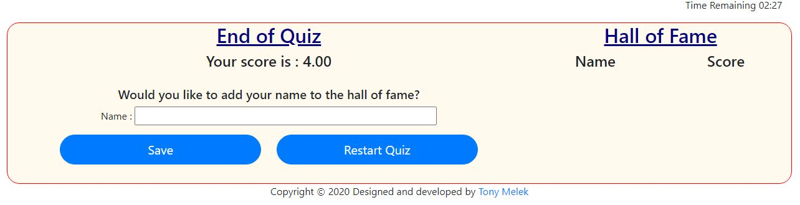
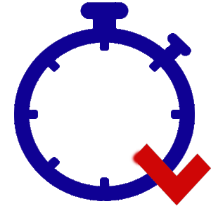

# Code Quiz
## Description
This a simple Beginner Level HTML Quiz. The Quiz starts with an introductory screen giving the user intructions and waits till they are ready to run the quiz, then quiz runs , then an End of Quiz screen.

* The Quiz Questions and answer options are read from a CSV file, which can be edited away from the code, just sticking to its current format.

* Questions are shuffled every time the quiz is run, and multiple choice options are shuffled as well.

## Features
* Start with Instructions

* Once, the quiz starts the user will see a counter running at the top right corner of the screen and will get the first question. 

* Everytime the user answers a question , they will be told if they answred correctly or not. If not 30 seconds will be deducted from the timer.
* If the user solved more than half the questions correctly, they will be granted a weighted bonus depending on the remaining time after they finish. (So, you need to answer correctly and quickly to get the highest score).
* Quiz ends whenever any of these happens first ( Times runs out, Questions run out).

* User is offered to add their name to the "Hall of Fame" everytime they have completed the Quiz.

**_Note:_** The Logo icon has been created as a timer a with inverted tick to form a "Q" like shape

## Test
You many try the Quiz by simply following the link to [Code-Quiz](https://tonymelek.github.io/code_quiz/).

## Feedback
You are welecome to provide any feedback or comments on the code to be sent to my e-mail [tonymelek.au@gmail.com](mailto:tonymelek.au@gmail.com)

## License
Code Quiz is &copy; copyight to Tony Melek 2020
